# 🤖 RAG Orchestrator Pipeline Chatbot

> **An end-to-end Retrieval-Augmented Generation (RAG) application with document ingestion, vector indexing, semantic retrieval, retrieval-confidence routing, context filtering, grounded LLM generation, and general-LLM fallback.**

This project implements a complete RAG workflow for building a knowledge-base chatbot.

The application takes documents, converts their content into searchable vector representations, stores them in **Pinecone**, and uses **Ollama** for embeddings and LLM-based response generation.

At query time, the system evaluates retrieval relevance before deciding whether to answer using the knowledge base or fall back to the LLM's general knowledge.

---

# 🏗️ System Architecture

<p align="center">
  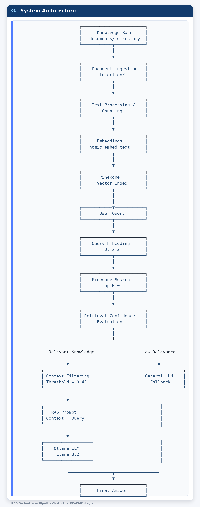
</p>


---

# 🚀 What This Project Does

The application implements two major workflows.

### 1. Document Ingestion

Documents are processed and converted into embeddings before being stored in Pinecone.

<p align="center">
  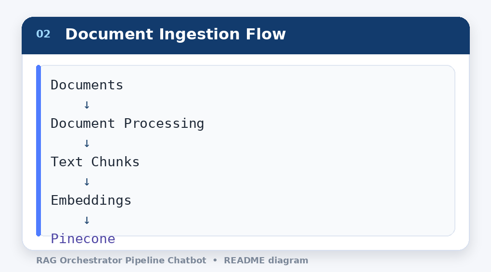
</p>

### 2. Question Answering

A user's question is embedded, searched against the vector database, evaluated for relevance, and then routed to either RAG generation or general LLM generation.

<p align="center">
  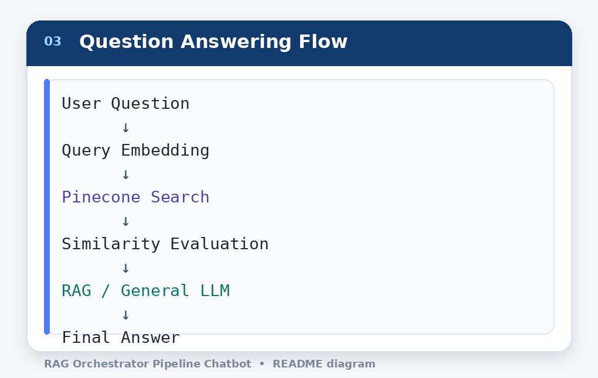
</p>

---

# 📥 Document Ingestion

The `documents/` folder contains the knowledge-base content used by the application.

The `injection/` module is responsible for taking document content and making it available for semantic retrieval.

Conceptually, the ingestion pipeline is:

<p align="center">
  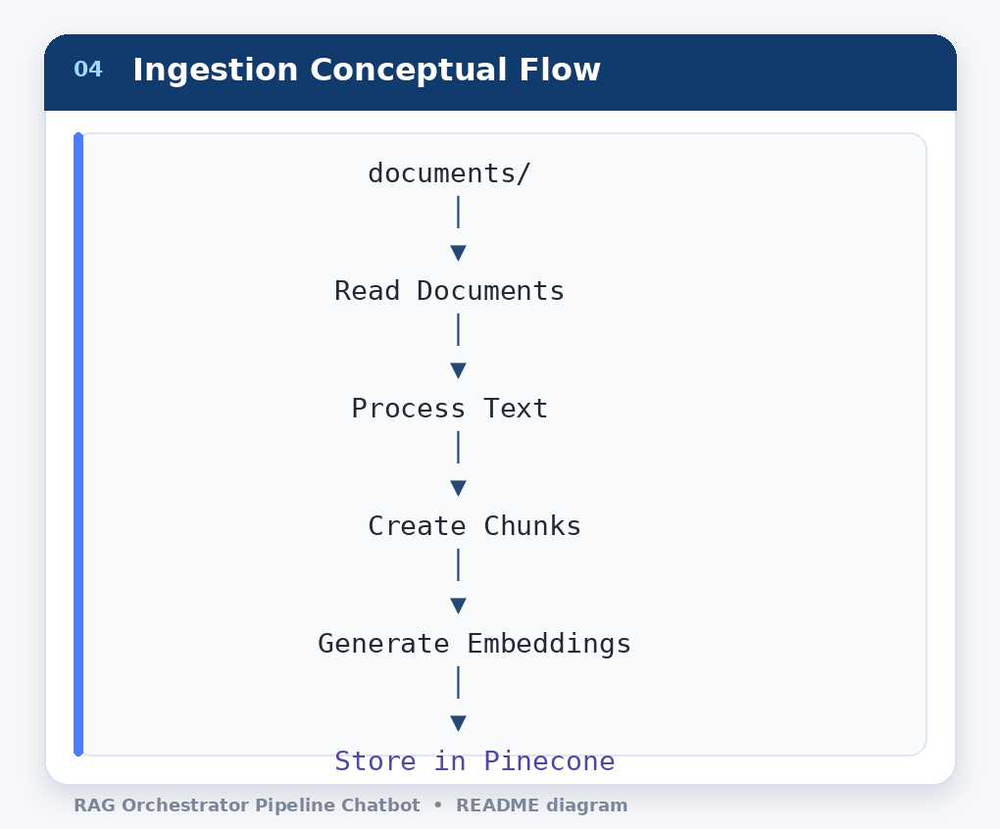
</p>

The resulting vector records contain searchable information that can later be retrieved by the RAG pipeline.

---

# 🧠 Embedding Architecture

The project uses:

<p align="center">
  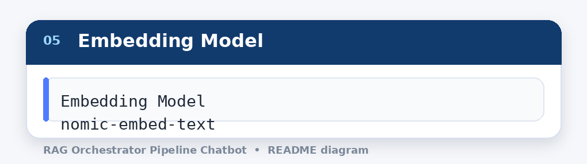
</p>

The same embedding model is used to represent textual information as vectors for semantic similarity search.

### Document Embedding

<p align="center">
  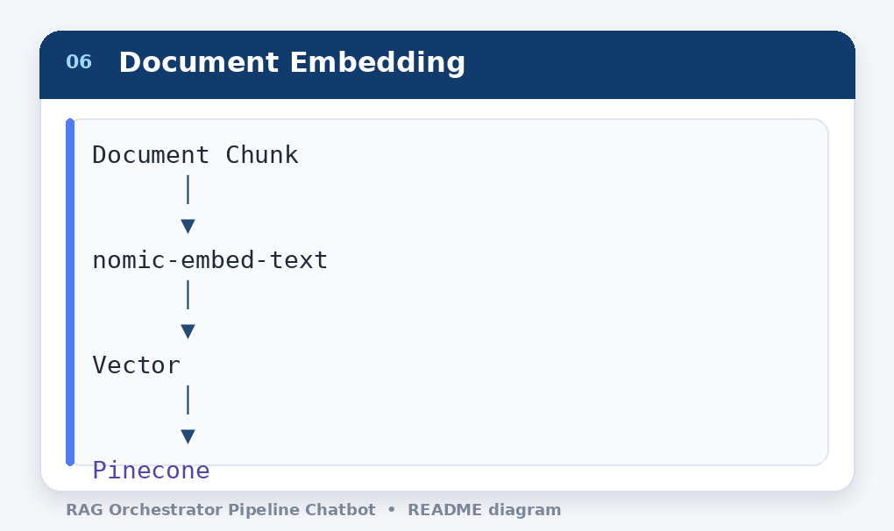
</p>

### Query Embedding

When the user asks a question:

<p align="center">
  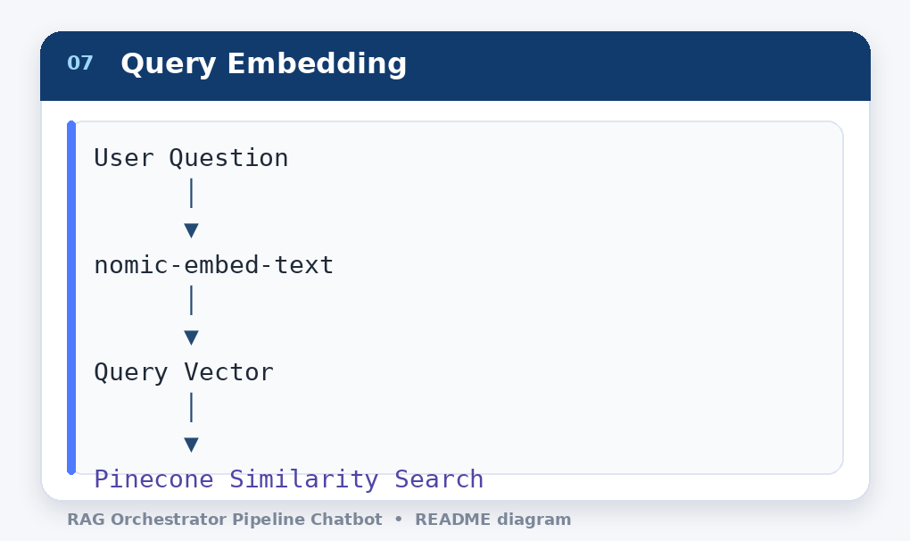
</p>

This allows the application to find conceptually similar content rather than relying only on exact keyword matching.

---

# 🌲 Pinecone Vector Database

Pinecone is used as the vector database.

Configured index:

<p align="center">
  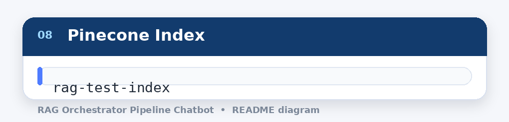
</p>

The application queries Pinecone using the generated query embedding and retrieves the most relevant records.

The retrieval configuration is:

```python
TOP_K = 5
```

Therefore, the pipeline requests the top five matching records from Pinecone for a query.

---

# 🔍 Query Processing Pipeline

The core query pipeline is implemented around the `ask_questions()` flow.

The processing sequence is:

<p align="center">
  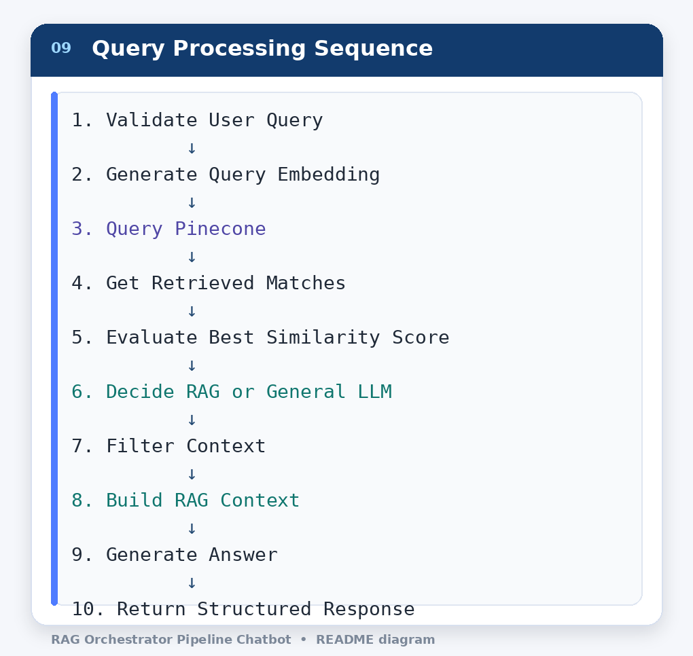
</p>

---

# 🎯 Retrieval Confidence Routing

One of the main features of the implementation is **retrieval-aware routing**.

The application does not blindly send every query through the RAG path.

It evaluates the best Pinecone similarity score first.

```python
RETRIEVAL_THRESHOLD = 0.55
```

The decision is:

<p align="center">
  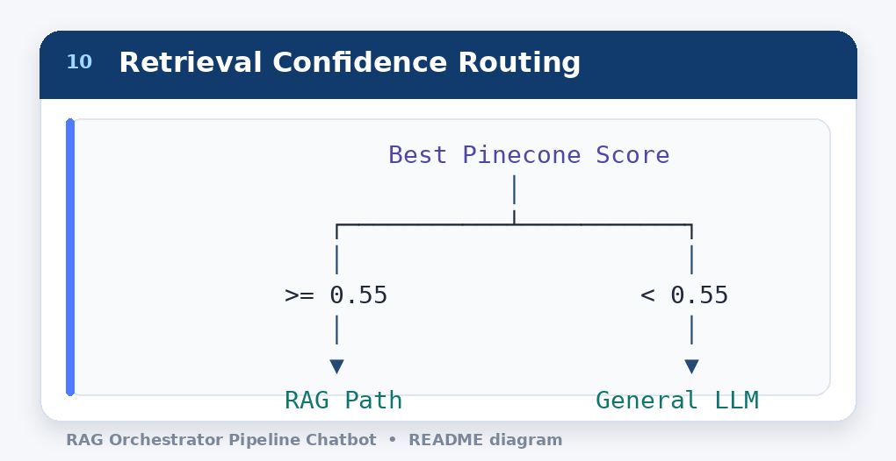
</p>

The source code explicitly compares the best retrieved score against `RETRIEVAL_THRESHOLD` before selecting the RAG or general-LLM path.

---

# 🧩 Context Filtering

Retrieval decision and context selection are treated separately.

The pipeline uses:

```python
CONTEXT_THRESHOLD = 0.40
```

Once the RAG path is selected, retrieved matches are filtered again.

<p align="center">
  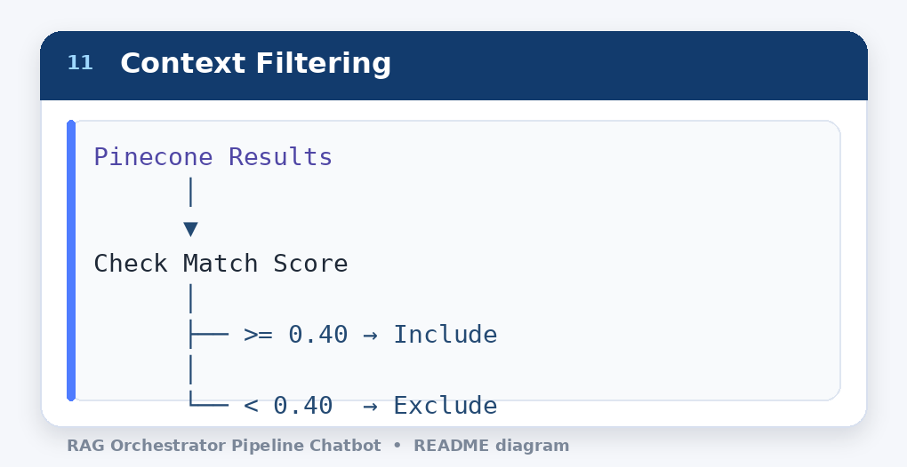
</p>

Only matches meeting the context threshold are added to the context supplied to the LLM.

This creates a two-level retrieval strategy:

<p align="center">
  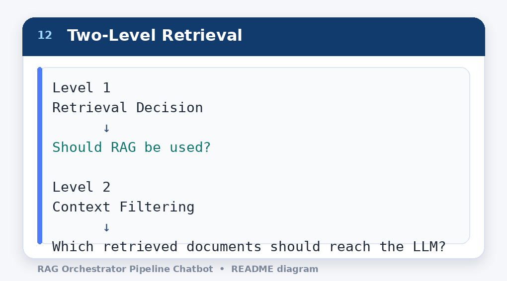
</p>

---

# 🧠 RAG Generation

When sufficiently relevant knowledge is found, the selected documents are combined into a context:

<p align="center">
  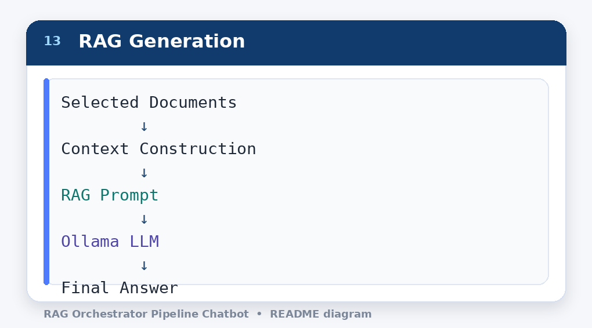
</p>

The RAG prompt instructs the model to use the supplied knowledge-base context as the primary source and avoid unsupported information.

The prompt also handles cases such as:

* missing information
* multi-part questions
* unrelated information
* different policies or categories
* unsupported addresses or details
* hallucinated facts

The generation layer therefore focuses on producing answers grounded in the retrieved context.

---

# 🔄 General LLM Fallback

If the best Pinecone result does not meet the retrieval threshold, the application does not force the query through the knowledge base.

Instead:

<p align="center">
  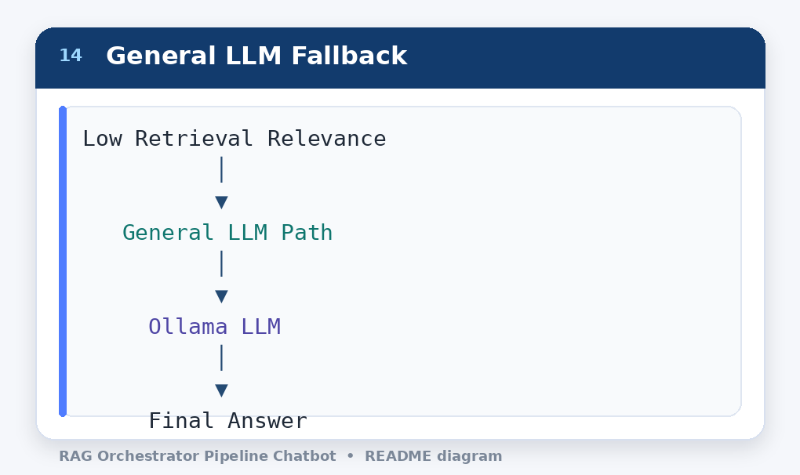
</p>

The fallback prompt explicitly tells the model that the knowledge base did not contain sufficiently relevant information and instructs it to answer using general pretrained knowledge.

This gives the application two response modes:

<p align="center">
  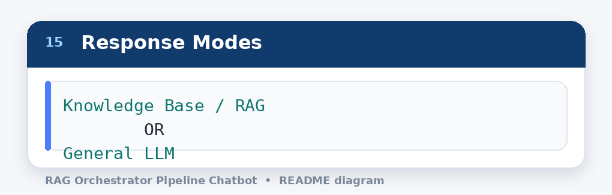
</p>

---

# 🛡️ Hallucination-Aware Prompting

The RAG generation prompt contains explicit rules to keep responses grounded in retrieved context.

The model is instructed to:

* use the supplied context as the primary source
* not invent information
* preserve the meaning of the context
* identify missing information
* avoid mixing unrelated information
* distinguish different policies correctly
* avoid exposing internal RAG implementation details

For example, if the retrieved context says that an office exists in a city but does not provide a street address, the model is instructed not to invent an address.

---

# 🦙 Ollama Integration

Ollama provides both the embedding and LLM interaction layer.

The project uses:

<p align="center">
  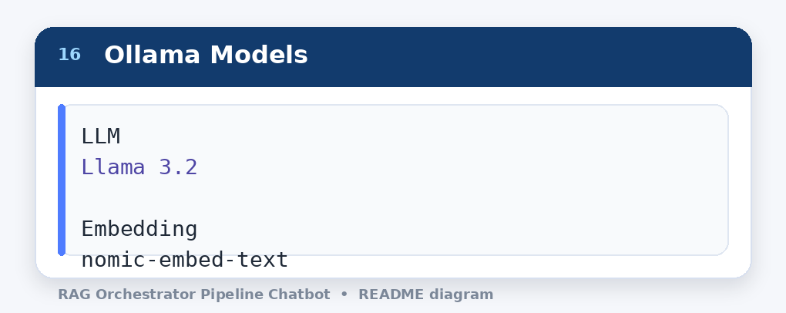
</p>

The application communicates with Ollama through an OpenAI-compatible client:

<p align="center">
  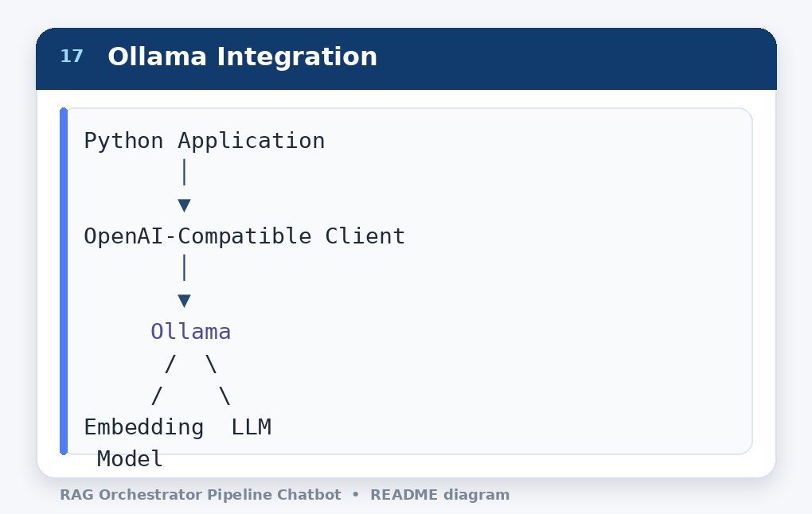
</p>

The source configures the Ollama endpoint using the environment variable `OLLAMA_URL`.

---

# 📊 Structured Pipeline Response

The RAG pipeline returns a structured result rather than only returning a plain string.

Example:

```python
{
    "answer": "...",
    "source": "Knowledge Base / RAG",
    "score": 0.78,
    "context": "..."
}
```

The implementation returns:

<p align="center">
  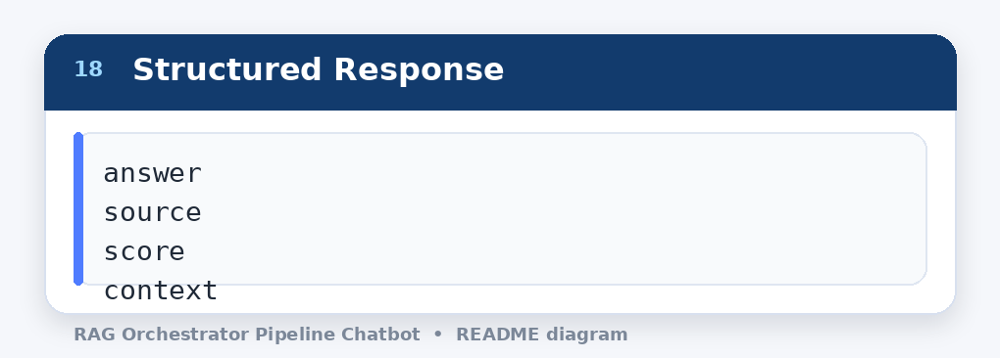
</p>

The `source` field identifies whether the response came from the knowledge base/RAG path or the general LLM path.

This makes the pipeline easier to integrate with a frontend application.

---

# 🖥️ Frontend

The `frontend/` folder contains the chatbot user-interface layer.

The frontend is separated from the core RAG orchestration so that:

<p align="center">
  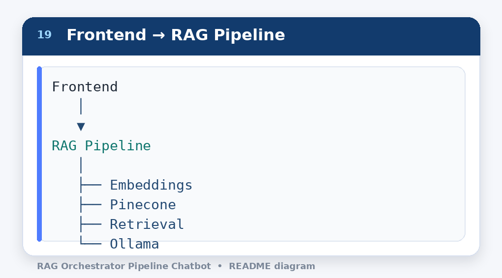
</p>

The core retrieval and generation logic therefore remains independent of the presentation layer.

---

# 📁 Project Structure

The repository is organized into separate application responsibilities:

<p align="center">
  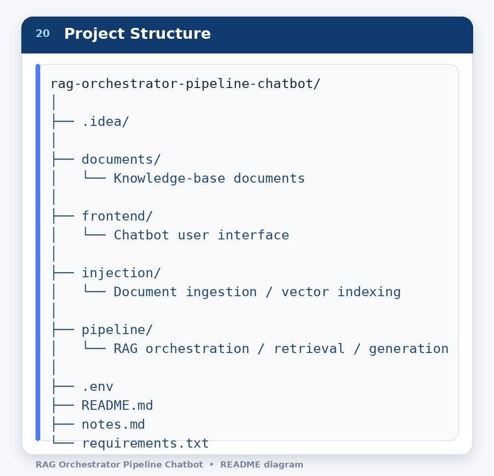
</p>

These top-level folders/files are present in the repository itself.

### Responsibility of Each Folder

| Folder       | Responsibility                                      |
| ------------ | --------------------------------------------------- |
| `documents/` | Knowledge-base source documents                     |
| `injection/` | Document ingestion and vector indexing              |
| `pipeline/`  | Query processing, retrieval, routing and generation |
| `frontend/`  | User-facing chatbot interface                       |
| `.idea/`     | IDE/project configuration                           |

---

# 🛠️ Technology Stack

| Technology            | Purpose                                |
| --------------------- | -------------------------------------- |
| **Python**            | Application and RAG orchestration      |
| **Ollama**            | Local LLM and embedding inference      |
| **Llama 3.2**         | LLM response generation                |
| **nomic-embed-text**  | Text embedding generation              |
| **Pinecone**          | Vector database and semantic search    |
| **OpenAI Python SDK** | OpenAI-compatible interface for Ollama |
| **python-dotenv**     | Environment configuration              |
| **Streamlit**         | Frontend/UI layer                      |

---

# ⚙️ Configuration

The application reads configuration from environment variables.

Example:

```env
PINECONE_KEY=your_pinecone_api_key

OLLAMA_URL=http://localhost:11434

EMBEDDING_MODEL=nomic-embed-text
```

The code validates that the required configuration exists before initializing the Pinecone and Ollama components.

> **Security:** Never commit real API keys or credentials to GitHub. Keep `.env` local and use an example configuration file for documentation.

---

# 🚀 Setup

## 1. Clone the Repository

```bash
git clone https://github.com/123-anubhav/rag-orchestrator-pipeline-chatbot.git

cd rag-orchestrator-pipeline-chatbot
```

## 2. Create Virtual Environment

### Windows

```bash
python -m venv venv
venv\Scripts\activate
```

### Linux / macOS

```bash
python3 -m venv venv
source venv/bin/activate
```

## 3. Install Dependencies

```bash
pip install -r requirements.txt
```

## 4. Configure Environment

Create a local `.env`:

```env
PINECONE_KEY=your_pinecone_api_key
OLLAMA_URL=http://localhost:11434
EMBEDDING_MODEL=nomic-embed-text
```

---

# 🦙 Ollama Setup

Install and start Ollama, then pull the required models:

```bash
ollama pull llama3.2
```

```bash
ollama pull nomic-embed-text
```

Verify:

```bash
ollama list
```

The application expects the Ollama endpoint configured through:

```env
OLLAMA_URL=http://localhost:11434
```

---

# 🌲 Pinecone Setup

Create/configure the Pinecone index used by the application:

<p align="center">
  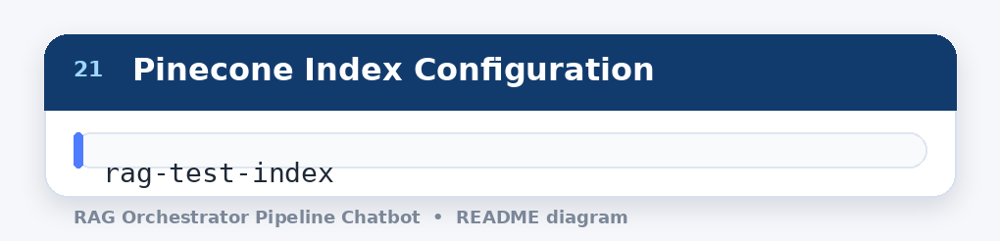
</p>

The embedding configuration used during ingestion must match the embedding configuration used when querying the index.

The query pipeline connects to the configured Pinecone index and performs vector similarity search with:

```python
TOP_K = 5
```

---

# 📥 Document Indexing Workflow

Place the knowledge-base files in:

<p align="center">
  
</p>

Then use the document ingestion functionality under:

<p align="center">
  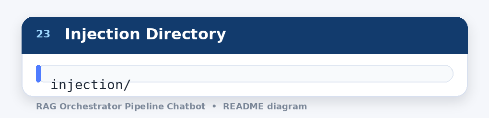
</p>

The conceptual indexing workflow is:

<p align="center">
  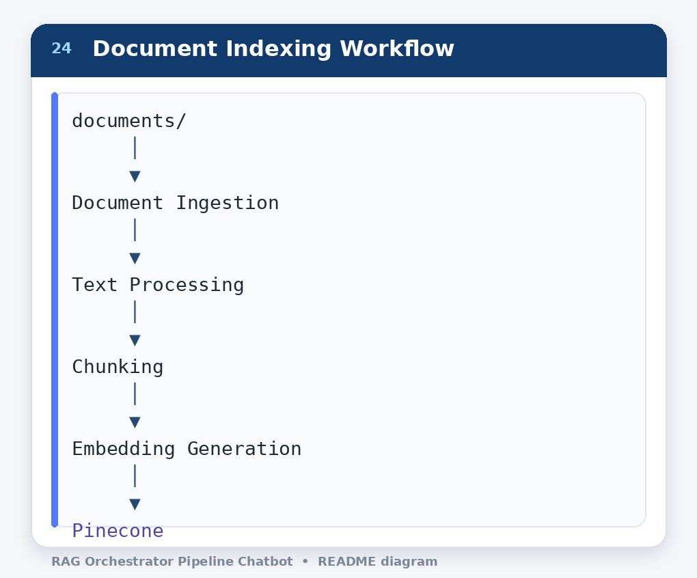
</p>

After indexing, the RAG pipeline can query those vectors.

> The repository's top-level `injection/` directory is confirmed, but the currently accessible GitHub view does not expose the exact script filenames inside it. Therefore this README intentionally avoids inventing a filename.

---

# ▶️ Running the RAG Pipeline

The query-side pipeline performs:

<p align="center">
  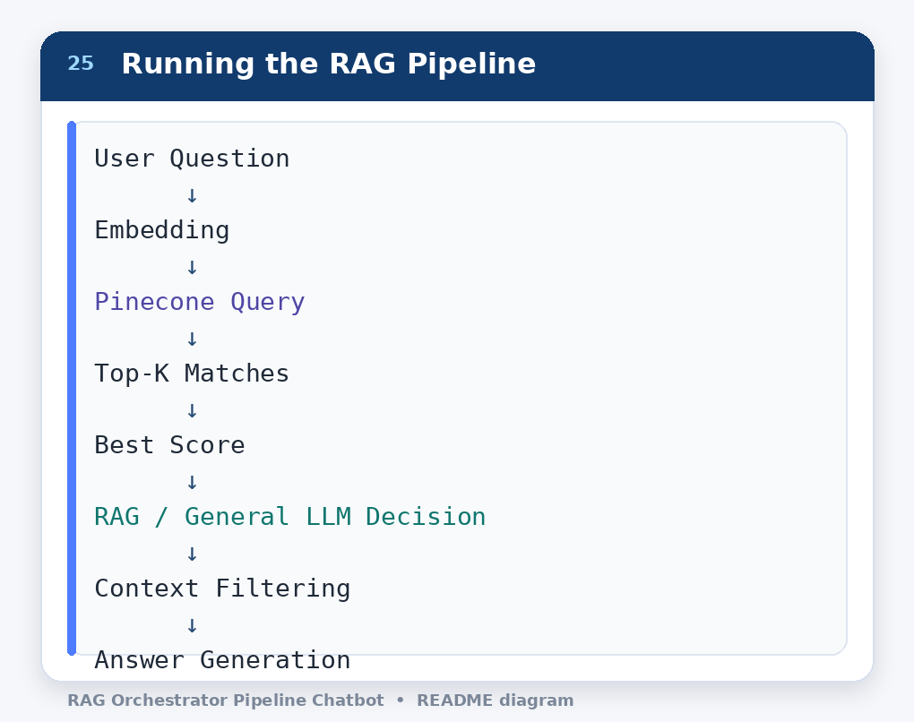
</p>

The source also contains local CLI testing through:

```python
if __name__ == "__main__":
```

and accepts:

<p align="center">
  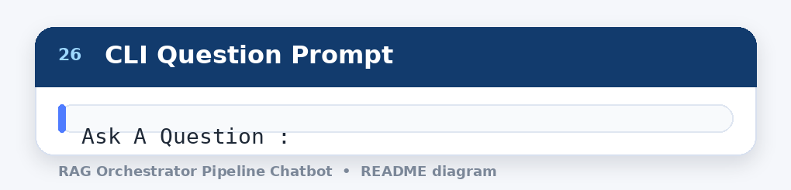
</p>

before executing the pipeline and displaying the final answer, source and Pinecone score.

---

# 💬 Example

### Knowledge-base question

<p align="center">
  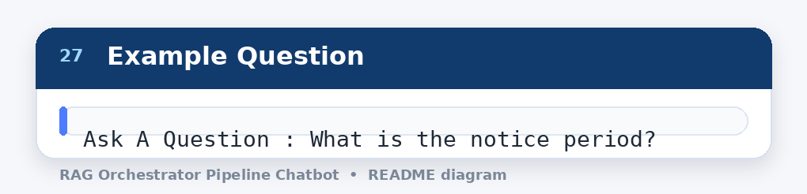
</p>

If the best Pinecone score is:

<p align="center">
  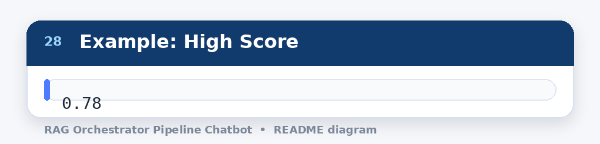
</p>

then:

<p align="center">
  
</p>

so the RAG path is selected.

<p align="center">
  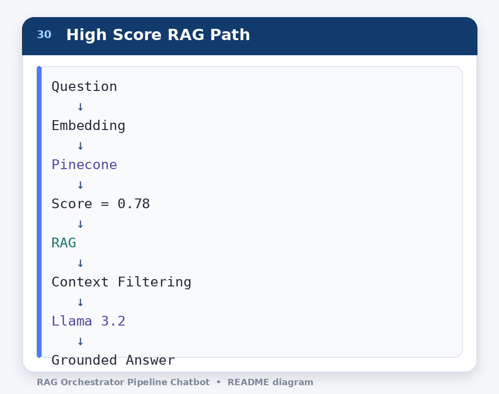
</p>

### Question outside the knowledge base

If the best score is:

<p align="center">
  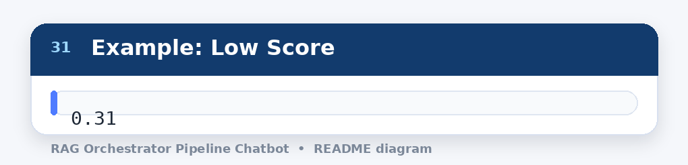
</p>

then:

<p align="center">
  
</p>

and the system uses the general LLM path.

<p align="center">
  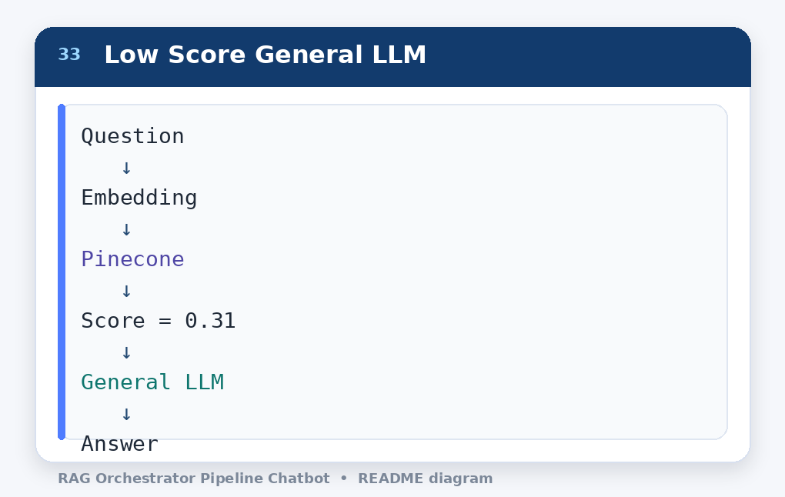
</p>

---

# 📐 Retrieval Configuration

The current pipeline uses:

| Configuration         |              Value | Purpose                                        |
| --------------------- | -----------------: | ---------------------------------------------- |
| `TOP_K`               |                `5` | Number of Pinecone matches retrieved           |
| `RETRIEVAL_THRESHOLD` |             `0.55` | Determines whether RAG is selected             |
| `CONTEXT_THRESHOLD`   |             `0.40` | Determines which matches enter the RAG context |
| `MODEL`               |         `llama3.2` | Response generation model                      |
| `EMBEDDING_MODEL`     | `nomic-embed-text` | Query/document embedding model                 |
| Pinecone index        |   `rag-test-index` | Vector storage/search                          |

These values are defined directly in the supplied pipeline implementation.

---

# 🔬 Core Engineering Decisions

## 1. Separate Retrieval Decision from Context Selection

The application does not use one threshold for everything.

<p align="center">
  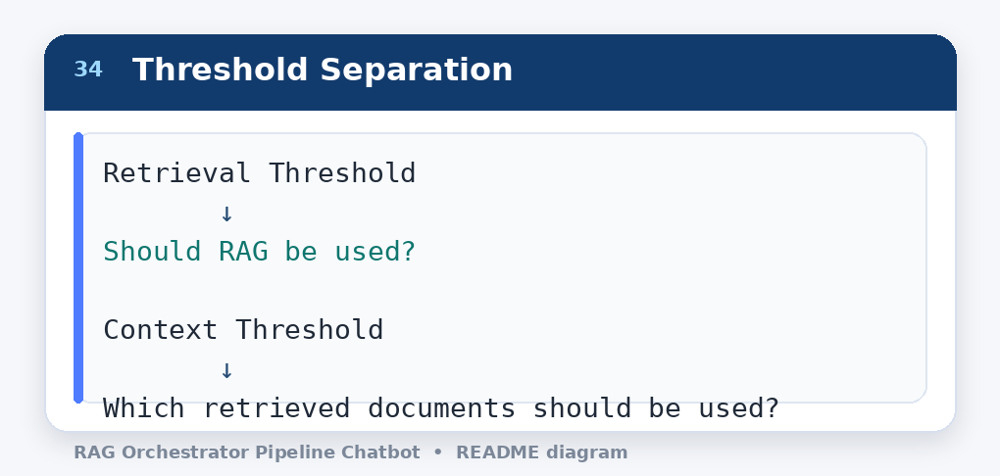
</p>

This provides more control over the quality of context supplied to the LLM.

---

## 2. Retrieval-Aware Fallback

The application does not assume that every query belongs to the knowledge base.

<p align="center">
  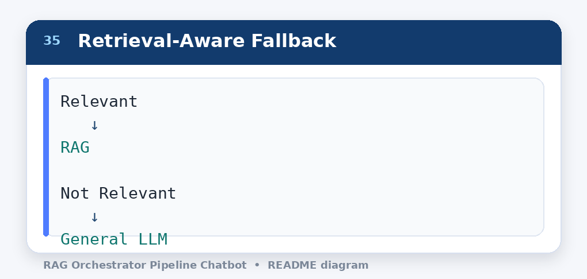
</p>

---

## 3. Grounded Generation

The RAG prompt explicitly tells the LLM to use the retrieved context and avoid unsupported information.

---

## 4. Separation of Responsibilities

The repository separates:

<p align="center">
  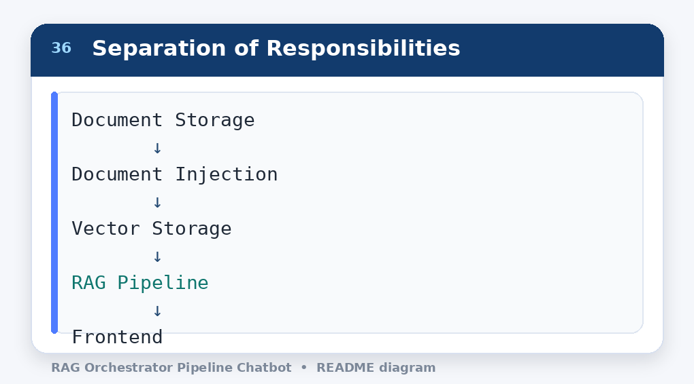
</p>

This keeps ingestion, retrieval, generation and presentation as separate application concerns.

---

## 5. Structured Output

The pipeline returns more than the answer:

<p align="center">
  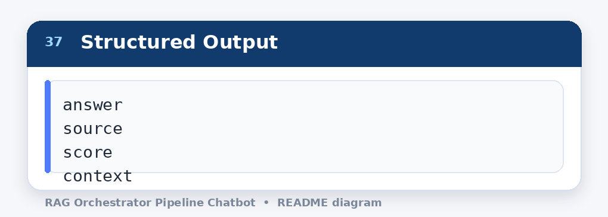
</p>

This allows the frontend to understand how the answer was generated.

---

# 🔐 Security

The project uses environment variables for sensitive configuration:

```env
PINECONE_KEY=...
OLLAMA_URL=...
EMBEDDING_MODEL=...
```

Do not commit secrets to source control.

Recommended repository practice:

<p align="center">
  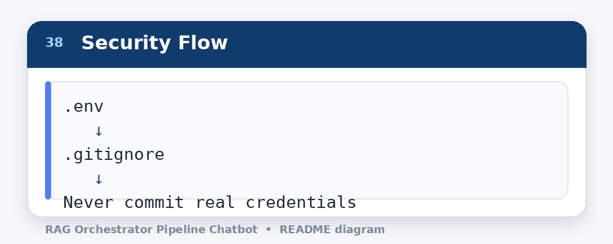
</p>

Use a sanitized example configuration for GitHub documentation.

---

# 📌 End-to-End Project Flow

The complete application can be viewed as two connected pipelines.

## Indexing Pipeline

<p align="center">
  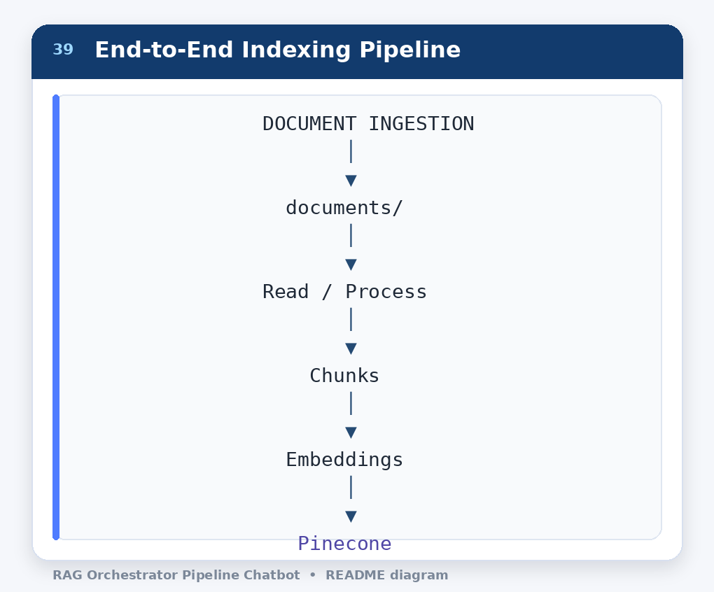
</p>

## Query Pipeline

<p align="center">
  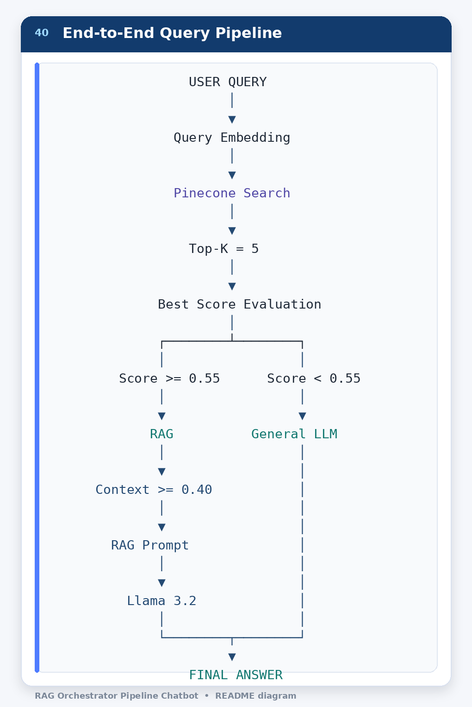
</p>

---

# 🎯 What This Project Demonstrates

This implementation demonstrates practical experience with:

* Retrieval-Augmented Generation
* Vector databases
* Semantic similarity search
* Embedding generation
* Document ingestion
* Vector indexing
* Top-K retrieval
* Retrieval confidence thresholds
* Context filtering
* Grounded prompt engineering
* LLM fallback strategies
* Local LLM inference with Ollama
* Pinecone integration
* Environment-based configuration
* Python-based GenAI application architecture
* Frontend integration with a RAG backend

---

# 👨‍💻 Author

**Anubhav Srivastava**

**Java Full Stack Developer | GenAI Developer**

GitHub:  
https://github.com/123-anubhav

Project:  
https://github.com/123-anubhav/rag-orchestrator-pipeline-chatbot

---

# ⭐ Project Summary

**RAG Orchestrator Pipeline Chatbot** implements a complete retrieval-aware GenAI workflow:

<p align="center">
  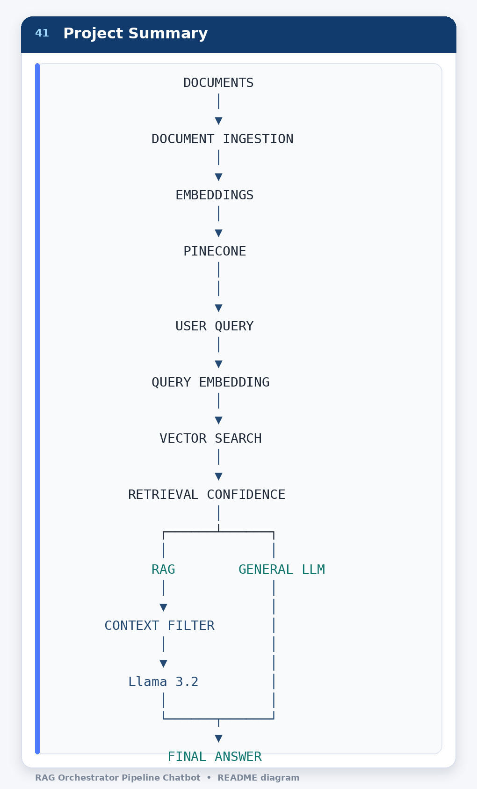
</p>

> **A complete practical RAG implementation combining document ingestion, embeddings, Pinecone vector search, retrieval-aware routing, context filtering, grounded generation, and LLM fallback using Python and Ollama.**
